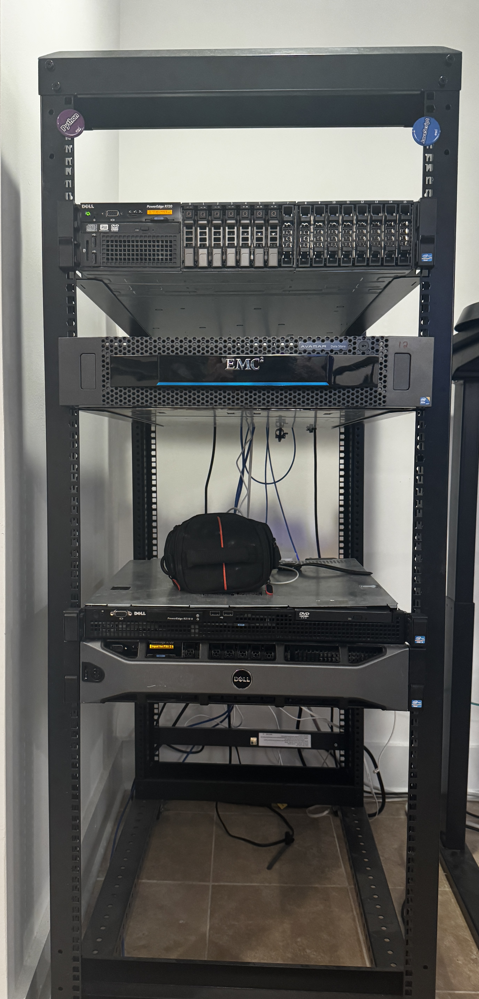
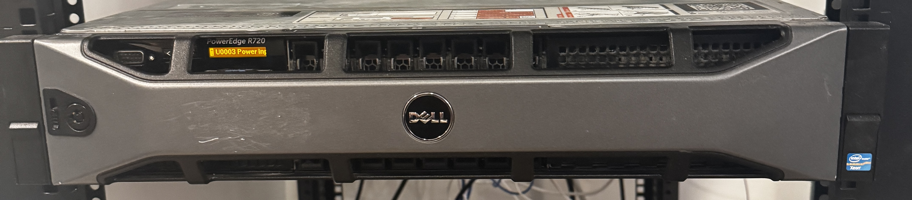
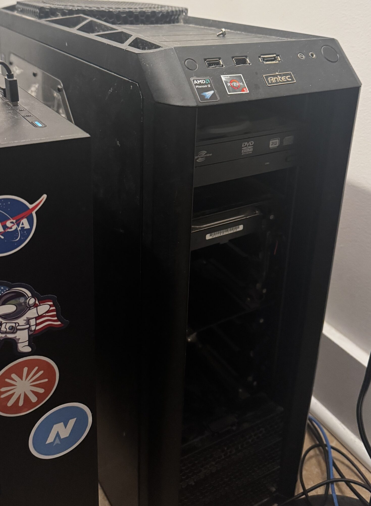
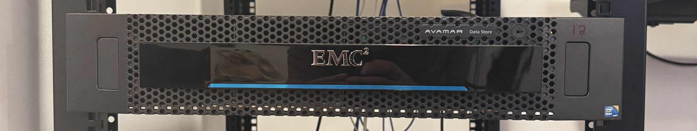
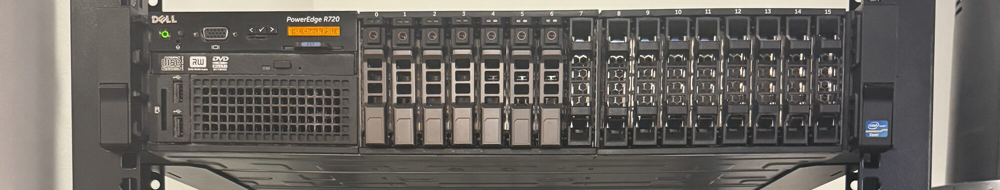
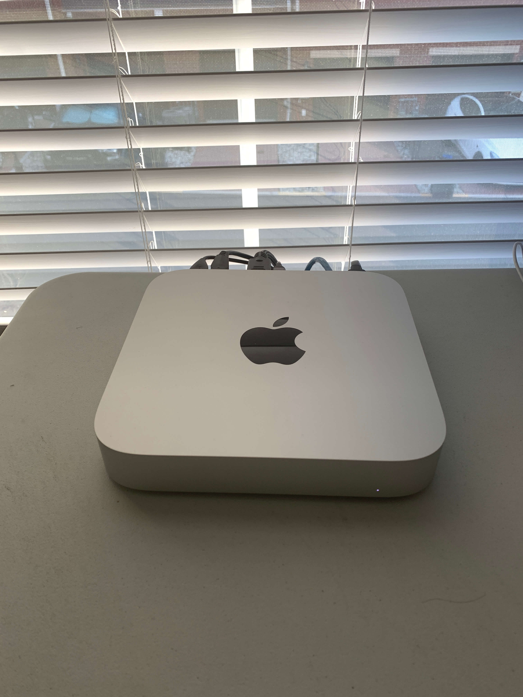
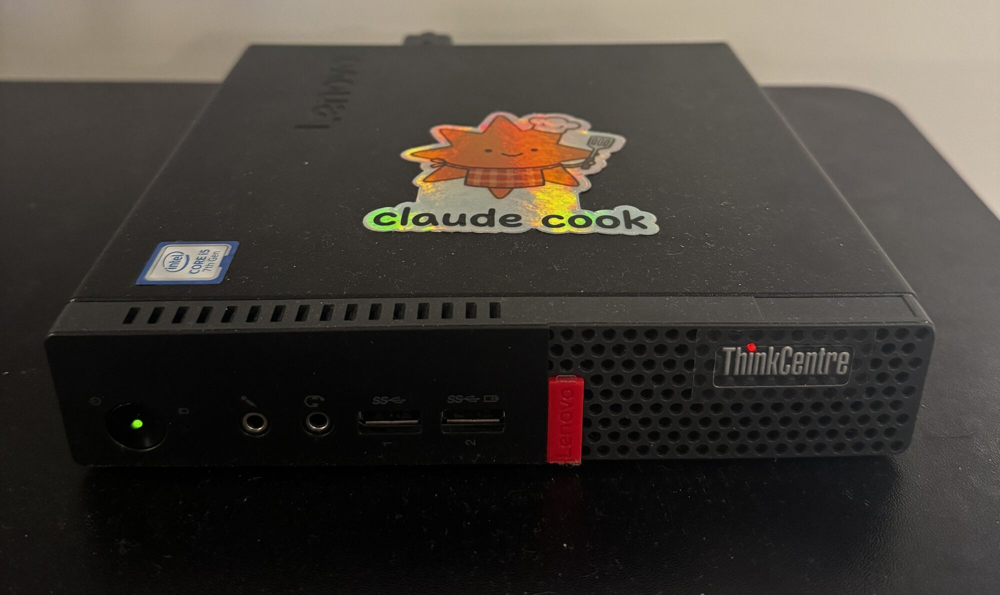

# frans-homelab

My homelab, in one repo. Anything I tinker with in the lab lands here — a lot of
it happens to be the Kubernetes cluster and the apps that run on it, but the lab
is bigger than the cluster: the bare-metal fleet underneath, the network, radios
(LoRa mesh + ham), SBCs, and whatever else is on the bench this month (see
[Misc tech](#misc-tech)).



The Kubernetes side — the biggest ongoing project here — has two layers:

| Layer | Directory | What it does | Changes |
|---|---|---|---|
| **Cluster** | [`cluster/`](cluster/) | Provisions the cluster from scratch — Proxmox VMs (Terraform) + Kubernetes, CNI, storage (Ansible). Bootstraps Argo CD. | Rarely |
| **GitOps** | [`gitops/`](gitops/) | Every app that runs on the cluster, declared for Argo CD. `git push` is the deploy mechanism. | Often |

```
frans-homelab/
├── cluster/            # was k8s-fun  — terraform + ansible, deploy.sh / destroy.sh
│   ├── terraform/      #   Proxmox VM definitions
│   ├── ansible/        #   k3s/kubeadm, Cilium, Ceph, ArgoCD, ...
│   └── README.md       #   full cluster-deploy docs
├── gitops/             # was app-of-apps  — Argo CD app-of-apps
│   ├── apps/           #   one Argo CD Application per app (root: app-of-apps.yaml)
│   ├── workloads/      #   the actual k8s manifests each Application points at
│   └── README.md       #   full GitOps + ops-runbook docs
├── docs/               # photos + notes
└── README.md           # you are here — hardware inventory, network, misc tech
```

Non-Kubernetes tinkering (Meshtastic, SBCs, one-off experiments) lives in this
README for now and gets its own directories as projects grow legs.

> **Bootstrap order:** `cluster/` builds the cluster **and installs Argo CD**, then points Argo CD at `gitops/apps`, which deploys everything else. So: **cluster first, GitOps second.**

---

## Hardware

### Physical hosts

Six bare-metal machines. The first five carry the cluster — Kubernetes nodes are **VMs on top of them** (see the next table). The sixth (`fran-lenovo-rocky-9`) is the standalone devbox and is **not part of the cluster**. Inventoried live over SSH, 2026-06-29; devbox added 2026-07-16; M1 Mac Mini added 2026-07-22 (physical specs not yet inventoried — see below).

#### `ProxMox Server` — Dell PowerEdge R720 · `.10`
<details><summary>ProxMox Server Photo</summary>

</details>

Primary Proxmox host — runs master-1, the Rocky workers, and ubuntu24-gpu-box (P4 GPU passed through)

- **CPU:** 2× Xeon E5-2660 v2 — 20c / 40t @ 2.2–3.0 GHz
- **RAM:** 192 GB DDR3-1866 — 12× 16 GB, 188 GiB usable (24 slots, max 1.5 TB)
- **OS:** Proxmox VE 9.2.3 / Debian 13 (kernel 7.0.6)
- **Storage:** 1 TB Samsung 980 PRO NVMe (`speedy-nvme-drive` LVM-thin — all
  k8s VM OS disks + worker-1's 150 G Ceph OSD; ~460 G free) + 500 GB Samsung
  870 EVO SATA SSD (Proxmox OS on `local-lvm`, plus master-1's 150 G Ceph OSD
  disk — moved off the NVMe 2026-07-07 for drive-level Ceph redundancy)

##### Fan control (IPMI)

After a reboot (or iDRAC reset) the R720 loses its manual fan override and the
fans go back to loud auto mode. Re-apply on the host as root (`apt install ipmitool` once):

```bash
ipmitool raw 0x30 0x30 0x01 0x00        # enable manual fan control
ipmitool raw 0x30 0x30 0x02 0xff 0x14   # fans to 20% (quiet — fine at idle, CPUs ~42 °C)
ipmitool raw 0x30 0x30 0x02 0xff 0x1e   # or 30% if temps creep up under sustained load
```

- Speed = last byte in hex: `0x14` 20%, `0x1e` 30%, `0x28` 40%.
- Back to automatic (loud) control: `ipmitool raw 0x30 0x30 0x01 0x01`
- Check temps after changing: `ipmitool sdr type temperature` — the two bare
  `Temp` sensors are the CPUs; bump to 30% if they hit the mid-70s °C.
- The override does **not** survive reboots/iDRAC resets — rerun after every
  reboot (or wire it into a systemd unit).
- If ipmitool says `Could not open device at /dev/ipmi0`:
  `modprobe ipmi_devintf ipmi_si` (add both to `/etc/modules` to persist).

#### `Old Desktop` — Gigabyte B450M DS3H · `.9`
<details><summary>Old Desktop Photo</summary>

</details>

Secondary standalone Proxmox host — Ryzen worker VM + XFCE desktop. Fastest per-core CPU → preferred home for CPU-bound workloads.

- **CPU:** Ryzen 5 3600 — 6c / 12t @ ≤4.2 GHz (Zen2)
- **RAM:** 40 GB DDR4-2133 — 16+8+16 GB, 39 GiB usable (4 slots, max 128 GB)
- **OS:** Proxmox VE 9.1.7 / Debian 13 (kernel 6.17.13)
- **Storage:** 250 GB Samsung 850 EVO SATA SSD (s/n `S2R5NX0H437857T`,
  ~26k h / ~26 TB written, healthy — `local-lvm`, hosts master-2's 50 G disk)
  + 4 TB Toshiba HDWE140 **internal** SATA HDD (VG `fran-4-tb-external` — the
  name lies) + DVD-RW
- ⚠️ Board ships with **SVM (AMD-V) disabled in BIOS** even though the `svm` flag shows — enable *SVM Mode* or `kvm_amd` won't load and no VM starts.

#### `Unraid NAS` — Dell EMC Avamar datastore (Intel S2600GZ board) · `.116`
<details><summary>Unraid NAS Photo</summary>

</details>

NAS — bulk media + nightly config backups, NFS-exported to the cluster.

- **CPU:** Xeon E5-2603 — 4c / 4t @ 1.8 GHz (no HT)
- **RAM:** 64 GB DDR3-1600 — 8× 8 GB, 63 GiB usable (16 slots, max 256 GB)
- **OS:** Unraid 7.3.1 (kernel 6.18.33)
- **Storage:** 2× 10.9 TB HDD array + 476 GB SSD cache (Intel RMS25CB080 HBA) + 16 GB boot USB

#### `TrueNas backup NAS` — Dell PowerEdge R720 · `.240`
<details><summary>TrueNas backup NAS Photo</summary>

</details>

NAS — TrueNAS SCALE (ZFS). The homelab's second R720.

- **CPU:** 2× Xeon E5-2640 — 12c / 24t @ 2.5–3.0 GHz
- **RAM:** ~110 GiB DDR3 usable (likely 128 GB; DIMM layout not enumerated — no root)
- **OS:** TrueNAS SCALE 25.10.3.1 / Debian 12 (kernel 6.12.33)
- **Storage:** 5× 5 TB Seagate ST5000LM000 HDD (ZFS `FranPool`, ~23 TB raw)
  + 2× 256 GB SSDs — **likely Inland Professional** (Micro Center purchase;
  Phison-controller white-label, model string just "SATA SSD"), behind the
  SAS HBA: boot-pool (s/n `21120225603051`) and `VM_Pool`
  (s/n `22082325601847`, fw SBFM61.5, 88% life — hosts master-3's 40 G zvol;
  reclaimed 2026-07-06 from the legacy "Plex Pool") + DVD-RW

#### `M1 Mac Mini` — Apple M1 · `.96`
<details><summary>M1 Mac Mini Photo</summary>

</details>

Hosts `mac-m1-worker`, the cluster's only **arm64** node (tainted
`arch=arm64:NoSchedule` — see the next table), as a nested Ubuntu VM. Physical
Mac specs (total RAM/storage, macOS version) not yet inventoried; figures
below are what the guest VM reports to Kubernetes, not the host machine's
full hardware.

- **vCPU / RAM (VM):** 6 vCPU / ~5.3 GiB allocatable
- **OS (VM):** Ubuntu 26.04 LTS (kernel 7.0.0-27-generic), containerd 2.2.2
- **Storage (VM):** ~62 GB ephemeral

#### `fran-lenovo-rocky-9 devbox` — Lenovo ThinkCentre M710q (10MR0004US) · `.192`
<details><summary>Devbox Photo</summary>

</details>

Devbox / workstation (`fsp` in SSH config) — **not a cluster member**, deliberately
(2026-07-16): only 4 threads and it's the interactive dev machine, so joining it
would couple the workspace to cluster scheduling for ~5% more capacity. Kaby Lake
has AVX2, so per-core it actually out-encodes the R720's Ivy Bridge Xeons at 35 W.

- **CPU:** i5-7500T — 4c / 4t @ 2.7–3.3 GHz (Kaby Lake, 35 W)
- **RAM:** 16 GB DDR4, 15 GiB usable (layout not enumerated — no passwordless sudo; 2 SODIMM slots, max 32 GB)
- **OS:** Rocky Linux 9.8 (kernel 5.14.0-611.5.1.el9_7)
- **Storage:** 256 GB Samsung PM981 NVMe (`MZVLB256HAHQ`) — OS only, no spare disk for Ceph

### Kubernetes nodes (VMs)

VMs running **on the physical hosts above** — kubeadm, mixed-arch (7× amd64 +
1× arm64). **HA control plane (2026-07-07):** 3 masters, one per physical
machine, behind **kube-vip VIP `.171`** (the API endpoint for
kubeconfigs, kubelets, and Cilium):

| Node | Arch | Runs on | Role |
|---|---|---|---|
| `k8s-cluster-prod-master` | amd64 | `pve` (R720), VM 135 (`.172`) | Control plane 1/3 + Ceph OSD (870 EVO) + mon `c` |
| `k8s-cp-old-ryzen-node` | amd64 | `fran` (B450M), VM 101 (`.108`, 2 vCPU / 8 GiB / 50 GiB) | Control plane 2/3 |
| `k8s-cp-truenas-node` | amd64 | `truenas` VM (`.249`, 2 vCPU / 8 GiB / 50 GiB, on `VM_Pool` SSD) | Control plane 3/3 + Ceph OSD (135 G zvol) + mon `e` |
| worker ×2 (Rocky Linux) | amd64 | `pve` (R720) | Workers (worker-1 also carries a Ceph OSD on the NVMe) |
| `ubuntu24-gpu-box` | amd64 | `pve` (R720), **Tesla P4** (GPU passthrough), 20 vCPU (raised from 12, 2026-07-21) | GPU workloads (Plex, ollama, Frigate, Immich-ML, nvidia-gpu-exporter) |
| `ubuntu-26-desktop-node` | amd64 | `fran` (B450M), VM 100 (`.76`, 10 vCPU / 16 GiB / 100 GiB, Ubuntu 26.04) | Worker + XFCE desktop + mon `d` |
| `mac-m1-worker` | **arm64** | Ubuntu VM on `M1 Mac Mini` | arm64 worker (tainted `arch=arm64:NoSchedule`) |

**GPU — Tesla P4:** 8 GB GDDR5, 2,560 CUDA cores (Pascal), 75 W single-slot, NVENC/NVDEC (incl. HEVC Main10/10-bit encode). **Time-sliced** (5 replicas, raised from 4 on 2026-07-21 to fit `nvidia-gpu-exporter`) so Plex + ollama + Frigate + Immich-ML + the exporter share it; consumers pinned with `nodeSelector: gpu=true`.

**GPU — AMD Radeon RX 570** (removed 2026-07-21, same day it went in): briefly passed through to `ubuntu-26-desktop-node` as an alternative to sharing the P4, but VCE 3.4 has **no HEVC Main10 (10-bit) encode entrypoint** -- confirmed with [`gitops/scripts/gpu-transcode-bench.sh`](gitops/scripts/README.md) -- and the media-reencode worker's whole library is 10-bit HEVC, so every HEVC-target transcode (e.g. Apple TV) silently fell back to full CPU software encode. Plex moved back to the P4 the same day; no other current workload (Jellyfin was considered) justified keeping a second GPU powered on, so `hostpci0` was removed from VM 100 and the card physically pulled to save power. `generic-device-plugin` (only ever used for this card) removed from git along with it.

### Storage

**Unraid NFS** (`.116`) — bulk media + nightly config backups (anything too big or recreatable for Ceph):

| Storage | FS | Size | Role |
|---|---|---|---|
| `disk1` / `disk2` | XFS | 11 TB each | Parity-protected array |
| `cache` | btrfs | 476 GB SSD | Write-cache pool |
| `/mnt/user` | shfs (FUSE) | 22 TB | Merged view, NFS-exported as `/mnt/user/FranData` |

> ⚠️ `/mnt/user` is shfs (FUSE) and hands out unstable NFS handles → pods hit `ESTALE`. Mitigated by setting `FranData` array-only (`shareUseCache=no`) + the `nfs-mount-healer` app. See [`gitops/README.md`](gitops/README.md) for detail.
> The healer only covers the media namespaces — **backup CronJobs are not covered**, and with `concurrencyPolicy: Forbid` a single pod wedged on a dead mount silently blocks all future backups (bit etcd for 3.5 days, 2026-07-10). After a NAS event, sweep non-Running pods and each backup CronJob's `lastSuccessfulTime`; the fix is deleting the pod/job (container restarts don't remount).

**Rook-Ceph** — block storage (`rook-ceph-block` / RBD): 3 OSDs, **one per
physical drive** (2026-07-07): `osd.3` 150 G on the `pve` 980 PRO NVMe
(worker-1), `osd.4` 150 G on the `pve` 870 EVO (master), `osd.0` 135 G on the
truenas `VM_Pool` SSD (`k8s-cp-truenas-node`, zvol `VM_Pool/for-ceph`).
`size=2` + one-OSD-per-node ⇒ every PG's replicas land on two different
drives — **any single drive can die without data loss** (whole-R720 loss
still risks PGs whose pair was 980+870). ~185 GiB usable. All three OSDs
bench healthy when idle (65–175 MiB/s 4M writes, ~4.2–7.6 k IOPS 4K). MONs `c`/`d`/`e` pinned
via `ceph-mon=true` node labels to one per physical machine. ⚠️ CephCluster
runs `useAllNodes/useAllDevices: true` — any empty raw disk attached to any
node becomes an OSD automatically. **Managed out-of-band** (not in Git) —
runbook in [`gitops/README.md`](gitops/README.md).

### Misc tech

The tinkering side of the lab — radios, SBCs, and microcontrollers. This is the
central inventory: exact models live here so I don't have to remember them.
Nothing here is wired into the cluster (yet); some of it may never be, and
that's the point. *Details and photos to come.*

#### Meshtastic

Two [Meshtastic](https://meshtastic.org/) LoRa mesh nodes, both picked up around DEF CON 2026 (August):

##### `SenseCAP Card Tracker T1000-E` — Seeed Studio
<!-- <details><summary>T1000-E Photo</summary>

</details> -->

Credit-card-sized tracker node. Bought the week before DEF CON.

- **MCU / Radio:** Nordic nRF52840 (BLE) + Semtech LR1110 (LoRa)
- **GPS:** onboard GNSS + accelerometer, temp & light sensors
- **Power:** built-in 700 mAh LiPo, magnetic charging cable
- **Form factor:** 85 × 55 × 6.5 mm, IP65
- **Role / config:** TBD

##### `RAK WisBlock 4631` — RAKwireless
<!-- <details><summary>RAK4631 Photo</summary>

</details> -->

Modular WisBlock-based node. Picked up at DEF CON itself.

- **MCU / Radio:** RAK4631 core — Nordic nRF52840 (BLE) + Semtech SX1262 (LoRa)
- **Form factor:** WisBlock base board + snap-on modules (expandable — GPS, sensors, e-ink, solar)
- **Base / modules / enclosure:** TBD
- **Role / config:** TBD

#### Ham radio

##### `Baofeng UV-5R`
<!-- <details><summary>UV-5R Photo</summary>

</details> -->

Dual-band VHF/UHF handheld transceiver.

- **Bands:** 2 m / 70 cm — 136–174 MHz (VHF) + 400–520 MHz (UHF), FM
- **Power:** ~4–5 W high / 1 W low; BL-5 1800 mAh Li-ion battery
- **Programming:** Kenwood 2-pin connector, CHIRP-compatible (cable: TBD)
- **License / callsign / channel plan:** TBD

##### `N9SAB 100W No-Tune EFHW` — end-fed half-wave HF antenna
<!-- <details><summary>EFHW Photo</summary>

</details> -->

Portable multi-band HF wire antenna (eBay, 2026-08). First piece of the HF
station build — resonant, so no tuner needed.

- **Bands:** 40 / 20 / 15 / 10 m, no tuner
- **Power:** 100 W
- **Type:** end-fed half-wave wire + matching transformer
- **Radio to drive it:** none yet — HF rig planned, likely Icom IC-7300
- **Deployment spot:** TBD

##### `ECO-WORTHY 12V 30Ah LiFePO4` — portable power
<!-- <details><summary>LiFePO4 Photo</summary>

</details> -->

Battery for the HF station build — will run the rig off-grid / portable
(POTA-style) and double as backup power.

- **Chemistry / capacity:** LiFePO4, 12 V 30 Ah (~384 Wh)
- **BMS:** built-in; 4000+ deep-cycle rated
- **Form factor:** drop-in replacement for a 12 V 35 Ah SLA
- **Charger / powerpole wiring:** TBD

#### SBCs & microcontrollers

| Device | Notes |
|---|---|
| Raspberry Pi 3 | Model/revision, OS, and role TBD |
| Arduino | Board model TBD |
| Arduino Mini | Details TBD |

---

## Network

- **CNI:** Cilium (no kube-proxy) + **Cilium Gateway API** for ingress & LB IPAM.
- **Gateway:** `main-gateway` at **`.202`**, wildcard TLS for `*.franpolignano.com`. Web UIs reach the cluster via `HTTPRoute`.
- **LoadBalancer pool:** `.200–203` (Cilium LB IPAM). Most services share `.201` via the `lbipam.cilium.io/sharing-key: "platform"` annotation.

| IP:port | Service |
|---|---|
| `.200:32400` | plex |
| `.201:7878` | radarr |
| `.201:8989` | sonarr |
| `.201:8080` | sabnzbd |
| `.201:5000` | weight-dashboard |
| `.202:80,443` | main-gateway (all `*.franpolignano.com` web UIs) |
| `.203:80` | open-webui |

(Full list in [`gitops/README.md`](gitops/README.md).)

---

## Deploy a cluster

Full docs: [`cluster/README.md`](cluster/README.md). Quick version:

```bash
cd cluster

# 1. Configure (both files are gitignored)
cp config.yml.example config.yml
cp terraform/terraform.tfvars.example terraform/terraform.tfvars
#   - config.yml: IPs, cluster settings, app toggles, and the argocd block
#                 (already defaulted to this repo: repo_url=frans-homelab, path=gitops/apps)
#   - terraform.tfvars: Proxmox password + SSH public key

# 2. Deploy (Terraform builds VMs, Ansible installs k8s + Cilium + ArgoCD)
./deploy.sh
#   or override: ./deploy.sh kubeadm metallb --memory 8192 --cores 4

# 3. Use it
export KUBECONFIG=$(pwd)/kubeconfig
kubectl get nodes
```

With `apps.argocd: true`, the bootstrap installs Argo CD and applies the root
`app-of-apps` Application pointing at **`gitops/apps`** in this repo — so the
GitOps layer comes up on its own.

**Tear down:** `cd cluster && ./destroy.sh` (`--cluster <name>` for a specific one).

---

## Deploy / change apps (GitOps)

Full docs + ops runbook: [`gitops/README.md`](gitops/README.md). The flow:

1. `gitops/workloads/<name>/` — the k8s manifests.
2. `gitops/apps/<name>.yaml` — an Argo CD `Application` pointing at `gitops/workloads/<name>`.
3. Secrets go in a gitignored `secret.yaml` applied out-of-band (never commit a real Secret).
4. `git push` — the root `app-of-apps` picks it up and Argo syncs within a few minutes.

All apps run with **automated sync, prune, and self-heal**, so `main` and the cluster stay in lock-step.
